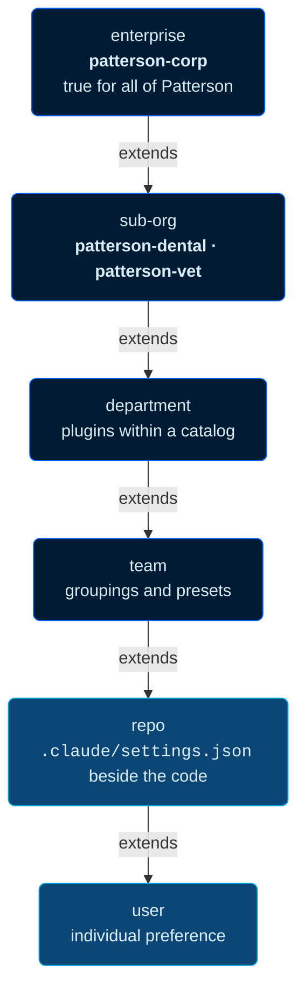

<div align="center">


<picture>
  <source media="(prefers-color-scheme: dark)" srcset="assets/patterson-logo-white.webp">
  
</picture>

# patterson-agents

**Trusted Expertise. Unrivaled Support.** — Patterson's institutional knowledge,
encoded as installable agent capability.


</div>

---

## What this is

Patterson Companies holds a large body of institutional knowledge — engineering standards, brand and editorial rules, architectural conventions, operational practice, and domain expertise particular to dental and veterinary distribution. Most of it lives in documents that people read once and then approximate from memory. The standard exists; the person who needed it never found it. Local practice drifts from documented practice, invisibly. A control gets assumed covered because something adjacent to it exists.

This organization makes that knowledge **available to AI agents at the moment of use** — versioned, attributable, reviewable, and owned by the teams accountable for it. The organizing intent is that an agent working on Patterson code should behave the way a well-oriented Patterson colleague would: aware of the standards that apply, able to cite them, and able to say plainly when a standard does not cover the situation at hand. Every assertion traces to a source you can open. Where a source is silent, the silence is recorded as a gap rather than filled with a plausible invention — an invention quietly becomes policy, while an acknowledged gap prompts someone to go fix it.

> [!NOTE]
> The repositories in this organization are **public** as of 2026-08-12. Several ship live
> GitHub Pages sites (corp.patterson.sh, design.patterson.sh, docs.patterson.sh,
> ds.patterson.sh, academy.pattersonskills.com, techdays.dev). The custom-domain binding
> is held in repository settings rather than in a tracked `CNAME`, so it is not verifiable
> from the tree alone.

### The layered model

Knowledge is not uniform. Some applies to all of Patterson; some only to a business segment, a department, a team, or a single repository. The marketplaces reflect that shape rather than flattening it.



Lower layers **extend** what they inherit by default, and **may override** when they know better. Divergence is treated as information about where a parent standard is incomplete — not as a violation to suppress.

---

## Quick start

Add a marketplace, then enable the plugins you want. Inside Claude Code:

```bash
# 1 — register the enterprise catalog
/plugin marketplace add patterson-agents/patterson-corp

# 2 — enable what applies to your work
/plugin install patterson-engineering@patterson-corp
/plugin install patterson-brand@patterson-corp

# 3 — add more catalogs as needed
/plugin marketplace add patterson-agents/design-plugins
/plugin marketplace add patterson-agents/patterson-labs
/plugin marketplace add patterson-agents/patterson-agencies-marketplace
```

> [!WARNING]
> Marketplace names occupy a **flat global namespace**, and the `@suffix` on an install command is the marketplace's `name` field — *not* its repository name. [`patterson-marketplace`](https://github.com/patterson-agents/patterson-marketplace) publishes under the name `patterson`; [`design-plugins`](https://github.com/patterson-agents/design-plugins) publishes under `patterson-design`; [`patterson-agencies-marketplace`](https://github.com/patterson-agents/patterson-agencies-marketplace) publishes under `patterson-agencies`. Registering a second catalog under an existing name replaces the first rather than merging with it.

> [!CAUTION]
> **Two live repositories both publish the marketplace name `patterson-design`.** [`design-plugins`](https://github.com/patterson-agents/design-plugins) is the canonical one — it is the intentional fork, taken because the original's git index is corrupt. [`patterson-design-plugins`](https://github.com/patterson-agents/patterson-design-plugins) is the superseded original and carries **no deprecation notice of its own**. Registering it silently *replaces* the registration from `design-plugins`. Use `design-plugins`.

VS Code and GitHub Copilot consume the same catalog — they read the identical `extraKnownMarketplaces` and `enabledPlugins` keys and defer to the same `marketplace.json` schema (see [ADR 0002](https://github.com/patterson-agents/patterson-corp/blob/main/docs/decisions/0002-cross-vendor-manifest-projection.md)).

**Rolling this out for a team or the org?** Settings compose across managed, enterprise, project, and user layers with well-defined precedence — and some of it is winner-take-all rather than merged. Read [`patterson-corp/docs/architecture/layered-settings.md`](https://github.com/patterson-agents/patterson-corp/blob/main/docs/architecture/layered-settings.md) before writing anything into [`managed-settings.d`](https://github.com/patterson-agents/patterson-marketplace/blob/main/docs/managed-settings.template.json).

---

## Marketplaces

Nine repositories ship a [`.claude-plugin/marketplace.json`](https://code.claude.com/docs/en/plugin-marketplaces); they publish **eight distinct names** because of the `patterson-design` collision noted above.

| Catalog | Marketplace `name` | Status | Plugins | Skills |
|---|---|---|---|---|
| [`patterson-corp`](https://github.com/patterson-agents/patterson-corp) | `patterson-corp` |  | 2 | 12 |
| [`design-plugins`](https://github.com/patterson-agents/design-plugins) | [`patterson-design`](https://github.com/patterson-agents/design-plugins/tree/main/plugins/patterson-brand/skills/patterson-design) |  | 9 | 9 |
| [`patterson-agencies-marketplace`](https://github.com/patterson-agents/patterson-agencies-marketplace) | `patterson-agencies` |  | 18 | 52 |
| [`patterson-labs`](https://github.com/patterson-agents/patterson-labs) | `patterson-labs` |  | 2 | 3 |
| [`patterson-marketplace`](https://github.com/patterson-agents/patterson-marketplace) | `patterson` |  | 1 | 2 |
| [`patterson-dental`](https://github.com/patterson-agents/patterson-dental) | `patterson-dental` |  | 0 | 0 |
| [`patterson-vet`](https://github.com/patterson-agents/patterson-vet) | `patterson-vet` |  | 0 | 0 |
| [`patterson-design-plugins`](https://github.com/patterson-agents/patterson-design-plugins) | `patterson-design` |  | 9 | 9 |
| [`patterson-skills`](https://github.com/patterson-agents/patterson-skills) | `patterson-skills` |  | 1 | 1 |

<details>
<summary><b><code>patterson-corp</code></b> — enterprise · 2 plugins · 12 skills&nbsp; </summary>

<br>

Capability true for all of Patterson: the standards layer and the brand layer. This is the catalog every Patterson engineer should have registered. Repo: [patterson-agents/patterson-corp](https://github.com/patterson-agents/patterson-corp).

| Plugin | What it does |
|---|---|
| [**`patterson-engineering`**](https://github.com/patterson-agents/patterson-corp/tree/main/plugins/patterson-engineering) `v0.2.0` | Encodes Patterson's IT standards for CI/CD, Azure environments, compute, storage and data classification, and monitoring — sourced from the ServiceNow IT Standards & Guidelines knowledge base. |
| [**`patterson-brand`**](https://github.com/patterson-agents/patterson-corp/tree/main/plugins/patterson-brand) `v0.1.0` | Patterson brand identity, design tokens, and editorial voice, with a drop-in Tailwind v4 + shadcn/ui theme derived from the 2025 Brand Guide. |

<details>
<summary><code>patterson-engineering</code> — 7 skills</summary>

- [`cicd-pipeline-standards`](https://github.com/patterson-agents/patterson-corp/tree/main/plugins/patterson-engineering/skills/cicd-pipeline-standards) — build/test/deploy pipelines, branch and PR policy, approvers, required scans, service connections, promotion to production
- [`azure-environment-standards`](https://github.com/patterson-agents/patterson-corp/tree/main/plugins/patterson-engineering/skills/azure-environment-standards) — the Sandbox / Dev / Test / Stage / Production tiers, subscriptions and landing zones, tagging and budgeting, DR requirements, exception approval
- [`azure-compute-standards`](https://github.com/patterson-agents/patterson-corp/tree/main/plugins/patterson-engineering/skills/azure-compute-standards) — VMs, VMSS, AVD, Windows 365, AKS, Container Apps and Instances, ACR, App Service; sizing, hardening, TLS, allowed base images
- [`storage-data-standards`](https://github.com/patterson-agents/patterson-corp/tree/main/plugins/patterson-engineering/skills/storage-data-standards) — data classification (PII, HIPAA), encryption, identity, backup and retention, redundancy and DR for storage, SQL, Cosmos DB, and managed disks
- [`monitoring-alerting-standards`](https://github.com/patterson-agents/patterson-corp/tree/main/plugins/patterson-engineering/skills/monitoring-alerting-standards) — the eight monitoring layers, PagerDuty routing, MTTD/MTTA/MTTR and DORA metrics, tool selection
- [`github-security-scanning`](https://github.com/patterson-agents/patterson-corp/tree/main/plugins/patterson-engineering/skills/github-security-scanning) — CodeQL, Dependabot, secret scanning with push protection, and the security policy a repo is required to carry
- [`approved-software-check`](https://github.com/patterson-agents/patterson-corp/tree/main/plugins/patterson-engineering/skills/approved-software-check) — is this tool approved for use at Patterson? Reports approved / approval-required / unknown with the owning team

</details>

<details>
<summary><code>patterson-brand</code> — 5 skills</summary>

- [`brand-identity`](https://github.com/patterson-agents/patterson-corp/tree/main/plugins/patterson-brand/skills/brand-identity) — the color palette and each color's role, logo usage and clear space, Proxima Nova typography, the mandatory sentence-case rule
- [`design-tokens`](https://github.com/patterson-agents/patterson-corp/tree/main/plugins/patterson-brand/skills/design-tokens) — drop-in Tailwind v4 `theme.css` plus a W3C `tokens.json`, and how to wire shadcn/ui to Patterson colors
- [`copy-style-guide`](https://github.com/patterson-agents/patterson-corp/tree/main/plugins/patterson-brand/skills/copy-style-guide) — editorial mechanics: AP style and Patterson's documented exceptions, numbers, dates, punctuation, product and business-unit naming
- [`voice-and-tone`](https://github.com/patterson-agents/patterson-corp/tree/main/plugins/patterson-brand/skills/voice-and-tone) — the corporate voice, the Patterson Dental marketing voice, and the social voice
- [`presentation-templates`](https://github.com/patterson-agents/patterson-corp/tree/main/plugins/patterson-brand/skills/presentation-templates) — Patterson-branded PowerPoint, Word, and OfficeSuite deliverables; chart colors, slide structure, where the official templates live

</details>

```bash
/plugin marketplace add patterson-agents/patterson-corp
/plugin install patterson-engineering@patterson-corp
/plugin install patterson-brand@patterson-corp
```

</details>

<details>
<summary><b><code>design-plugins</code></b> — design system · 9 plugins · marketplace name <code>patterson-design</code>&nbsp; </summary>

<br>

The Patterson design system packaged as nine individually installable plugins. Each ships a skill, slash commands, a subagent, and a self-contained `ds/` design-system snapshot — no build step, no CDN. **Install [`patterson-brand`](https://github.com/patterson-agents/design-plugins/tree/main/plugins/patterson-brand) first**; the rest build on it. Repo: [patterson-agents/design-plugins](https://github.com/patterson-agents/design-plugins).

| Plugin | What it is | Skill |
|---|---|---|
| [**`patterson-brand`**](https://github.com/patterson-agents/design-plugins/tree/main/plugins/patterson-brand) `v1.1.0` | Design-system core — tokens, fonts, logos, brand imagery, React components, guideline specimens, and framework adapters (Tailwind v3/v4, UnoCSS, Theme UI, shadcn/ui) | [`patterson-design`](https://github.com/patterson-agents/design-plugins/tree/main/plugins/patterson-brand/skills/patterson-design) |
| [**`patterson-deck`**](https://github.com/patterson-agents/design-plugins/tree/main/plugins/patterson-deck) `v1.1.0` | 16:9 presentation template — cover, section dividers, stats, comparison, quote, capabilities table, photo band, closing | [`deck-template`](https://github.com/patterson-agents/design-plugins/tree/main/plugins/patterson-deck/skills/deck-template) |
| [**`patterson-executive-deck`**](https://github.com/patterson-agents/design-plugins/tree/main/plugins/patterson-executive-deck) `v1.1.0` | Executive briefing deck — navy cover, key takeaways, breakdown matrix, requirements, outputs, benefits | [`executive-deck-template`](https://github.com/patterson-agents/design-plugins/tree/main/plugins/patterson-executive-deck/skills/executive-deck-template) |
| [**`patterson-corporate-page`**](https://github.com/patterson-agents/design-plugins/tree/main/plugins/patterson-corporate-page) `v1.1.0` | Corporate web page shell — sticky nav, navy hero, content band, footer | [`corporate-page-template`](https://github.com/patterson-agents/design-plugins/tree/main/plugins/patterson-corporate-page/skills/corporate-page-template) |
| [**`patterson-corporate-website`**](https://github.com/patterson-agents/design-plugins/tree/main/plugins/patterson-corporate-website) `v1.1.0` | Corporate-site UI kit — recreation of pattersoncompanies.com as separate React screens | [`corporate-website-kit`](https://github.com/patterson-agents/design-plugins/tree/main/plugins/patterson-corporate-website/skills/corporate-website-kit) |
| [**`patterson-storefront`**](https://github.com/patterson-agents/design-plugins/tree/main/plugins/patterson-storefront) `v1.1.0` | E-commerce storefront kit (pattern library v5.7.2 shell) with a Dental ↔ Veterinary brand toggle | [`storefront-kit`](https://github.com/patterson-agents/design-plugins/tree/main/plugins/patterson-storefront/skills/storefront-kit) |
| [**`patterson-file-manager`**](https://github.com/patterson-agents/design-plugins/tree/main/plugins/patterson-file-manager) `v1.1.0` | "Skill Studio" application shell — top bar, sidebar tree, content grid; a template for internal tools | [`file-manager-template`](https://github.com/patterson-agents/design-plugins/tree/main/plugins/patterson-file-manager/skills/file-manager-template) |
| [**`patterson-docs`**](https://github.com/patterson-agents/design-plugins/tree/main/plugins/patterson-docs) `v1.1.0` | Documentation-site package — VitePress + Diátaxis UI kit and a browser-openable page template | [`docs-site`](https://github.com/patterson-agents/design-plugins/tree/main/plugins/patterson-docs/skills/docs-site) |
| [**`patterson-tutorialkit`**](https://github.com/patterson-agents/design-plugins/tree/main/plugins/patterson-tutorialkit) `v1.3.0` | Astro TutorialKit theme — runnable starter, canonical `theme.css`, and a 5-part / 18-lesson agent-tooling curriculum | [`tutorialkit-theme`](https://github.com/patterson-agents/design-plugins/tree/main/plugins/patterson-tutorialkit/skills/tutorialkit-theme) |

```bash
/plugin marketplace add patterson-agents/design-plugins
/plugin install patterson-brand@patterson-design
/plugin install patterson-deck@patterson-design
```

> [!IMPORTANT]
> Two plugins named `patterson-brand` exist — one here ([`@patterson-design`](https://github.com/patterson-agents/design-plugins/tree/main/plugins/patterson-brand), the design-system core) and one in [`patterson-corp`](https://github.com/patterson-agents/patterson-corp/tree/main/plugins/patterson-brand) (`@patterson-corp`, the brand-standards encoding). The collision is at the plugin tier, not the marketplace tier; see [ADR 0003](https://github.com/patterson-agents/patterson-corp/blob/main/docs/decisions/0003-plugin-name-reconciliation.md). Always qualify installs with the `@marketplace` suffix.

</details>

<details>
<summary><b><code>patterson-agencies-marketplace</code></b> — company catalog · 18 plugins · 52 skills · 262 agents · marketplace name <code>patterson-agencies</code>&nbsp; </summary>

<br>

The largest catalog in the org, and the newest. **One plugin per company** — a business unit, a product team, or an internal engineering org — each carrying its own agents, skills, mission, org overlay, and a full development team, plus a reference set and brand sheet. Markdown output targets GitHub Flavored Markdown throughout, including Mermaid org charts that render inline. Repo: [patterson-agents/patterson-agencies-marketplace](https://github.com/patterson-agents/patterson-agencies-marketplace).

| Plugin | Scope |
|---|---|
| [**`pdco-core`**](https://github.com/patterson-agents/patterson-agencies-marketplace/tree/main/plugins/pdco-core) | Conventions, handling rules, and escalation paths shared by every business unit and product team |
| [**`pdco-corporate`**](https://github.com/patterson-agents/patterson-agencies-marketplace/tree/main/plugins/pdco-corporate) | Corporate segment work: finance, legal, people, IT governance, and cross-segment reporting |
| [**`pdco-dental`**](https://github.com/patterson-agents/patterson-agencies-marketplace/tree/main/plugins/pdco-dental) | North American dental distribution, equipment, service, and the practice technology attached to them |
| [**`pdco-vet-companion`**](https://github.com/patterson-agents/patterson-agencies-marketplace/tree/main/plugins/pdco-vet-companion) | Companion animal distribution, equipment, and practice services across the US and Canada |
| [**`pdco-animal-health-intl`**](https://github.com/patterson-agents/patterson-agencies-marketplace/tree/main/plugins/pdco-animal-health-intl) | Production animal distribution to cattle, dairy, swine, poultry, and equine operations |
| [**`pdco-nvs-uk`**](https://github.com/patterson-agents/patterson-agencies-marketplace/tree/main/plugins/pdco-nvs-uk) | The United Kingdom animal health business, its acquisitions, and its UK regulatory posture |
| [**`pdco-technology-center`**](https://github.com/patterson-agents/patterson-agencies-marketplace/tree/main/plugins/pdco-technology-center) | Software development and customer technical support for the practice management portfolio |
| [**`pdco-supply-chain`**](https://github.com/patterson-agents/patterson-agencies-marketplace/tree/main/plugins/pdco-supply-chain) | The distribution network, inventory position, and vendor relationships behind both segments |
| [**`pdco-eaglesoft`**](https://github.com/patterson-agents/patterson-agencies-marketplace/tree/main/plugins/pdco-eaglesoft) | The on-premise dental practice management system and the estate that runs it |
| [**`pdco-fuse`**](https://github.com/patterson-agents/patterson-agencies-marketplace/tree/main/plugins/pdco-fuse) | The cloud dental practice management platform for multi-location practices and groups |
| [**`pdco-navetor`**](https://github.com/patterson-agents/patterson-agencies-marketplace/tree/main/plugins/pdco-navetor) | The cloud veterinary practice management platform and its AI workflow assistant |
| [**`pdco-intravet`**](https://github.com/patterson-agents/patterson-agencies-marketplace/tree/main/plugins/pdco-intravet) | The on-premise veterinary practice management system and its installed base |
| [**`pdco-act`**](https://github.com/patterson-agents/patterson-agencies-marketplace/tree/main/plugins/pdco-act) | Veterinary practice training, data conversion, and staffing services |
| [**`pdco-dental-eservices`**](https://github.com/patterson-agents/patterson-agencies-marketplace/tree/main/plugins/pdco-dental-eservices) | The integrated partner portfolio around the dental practice management systems |
| [**`pdco-vet-services`**](https://github.com/patterson-agents/patterson-agencies-marketplace/tree/main/plugins/pdco-vet-services) | Teleradiology, client engagement, compliance, payments, and technology services around veterinary practice |
| [**`pdco-act-data`**](https://github.com/patterson-agents/patterson-agencies-marketplace/tree/main/plugins/pdco-act-data) | The bidirectional practice management integration layer, multi-hospital aggregation, standardized data |
| [**`pdco-payments`**](https://github.com/patterson-agents/patterson-agencies-marketplace/tree/main/plugins/pdco-payments) | Processor connectors, hosted payment fields, terminal provisioning, and the PCI scope around them |
| [**`pdco-platform-sre`**](https://github.com/patterson-agents/patterson-agencies-marketplace/tree/main/plugins/pdco-platform-sre) | The build and packaging system, the observability spine, and the internal agent platform |

```bash
/plugin marketplace add patterson-agents/patterson-agencies-marketplace
/plugin install pdco-navetor@patterson-agencies
```

> [!IMPORTANT]
> Named individuals and their contact details are deliberately excluded throughout; roles are referenced instead. Three companies carry operational detail that is not published elsewhere. Treat this repository as internal. See its [`CONTRIBUTING.md`](https://github.com/patterson-agents/patterson-agencies-marketplace/blob/main/CONTRIBUTING.md) and [`REFERENCES.md`](https://github.com/patterson-agents/patterson-agencies-marketplace/blob/main/REFERENCES.md) before publishing anything from it.

</details>

<details>
<summary><b><code>patterson-labs</code></b> — incubation · 2 plugins · 3 skills&nbsp; </summary>

<br>

Where experimental capability earns its way into [`patterson-corp`](https://github.com/patterson-agents/patterson-corp). Nothing here is enterprise policy yet. Repo: [patterson-agents/patterson-labs](https://github.com/patterson-agents/patterson-labs).

| Plugin | What it is | Skills |
|---|---|---|
| [**`patterson-workflows`**](https://github.com/patterson-agents/patterson-labs/tree/main/plugins/patterson-workflows) `v0.1.0` | A conversational interview that designs one complete [GitHub Agentic Workflow](https://github.com/github/gh-aw) (`gh aw`) file from a stated goal — trigger, scope, data strategy, guardrails, network, engine | [`agentic-workflow-designer`](https://github.com/patterson-agents/patterson-labs/tree/main/plugins/patterson-workflows/skills/agentic-workflow-designer) |
| [**`patterson-design-imports`**](https://github.com/patterson-agents/patterson-labs/tree/main/plugins/patterson-design-imports) `v0.1.0` | Design tokens imported from the [`patterson-academy`](https://github.com/patterson-agents/patterson-academy) and [`lab-workshop`](https://github.com/patterson-agents/lab-workshop) authoring projects. Each ships a Tailwind v4 `theme.css`, a W3C `tokens.json`, a byte-identical generator, and a drift check — with every conflict against the 2025 Brand Guide recorded and the Brand Guide winning | [`academy-design-tokens`](https://github.com/patterson-agents/patterson-labs/tree/main/plugins/patterson-design-imports/skills/academy-design-tokens) · [`lab-workshop-design-tokens`](https://github.com/patterson-agents/patterson-labs/tree/main/plugins/patterson-design-imports/skills/lab-workshop-design-tokens) |

```bash
/plugin marketplace add patterson-agents/patterson-labs
/plugin install patterson-workflows@patterson-labs
```

> [!NOTE]
> [`patterson-design-imports`](https://github.com/patterson-agents/patterson-labs/tree/main/plugins/patterson-design-imports) does **not** supersede [`patterson-brand`](https://github.com/patterson-agents/design-plugins/tree/main/plugins/patterson-brand). That supersession ruling is still open.

</details>

<details>
<summary><b><code>patterson-marketplace</code></b> — org catalog + vendored skill library · 1 plugin · marketplace name <code>patterson</code>&nbsp; </summary>

<br>

Repo: [patterson-agents/patterson-marketplace](https://github.com/patterson-agents/patterson-marketplace).

| Plugin | What it is | Skill |
|---|---|---|
| [**`patterson-design`**](https://github.com/patterson-agents/patterson-marketplace/tree/main/plugins/patterson-design) | The Patterson design system as a single plugin: brand tokens, components, voice, and logos for on-brand interfaces, prototypes, and slides | [`patterson-design`](https://github.com/patterson-agents/patterson-marketplace/tree/main/plugins/patterson-design/skills/patterson-design) |

The repo also ships a [`plugins/_template/`](https://github.com/patterson-agents/patterson-marketplace/tree/main/plugins/_template) plugin scaffold, plugin-management scripts ([`scripts/plugins.sh`](https://github.com/patterson-agents/patterson-marketplace/blob/main/scripts/plugins.sh) `add|update|remove`), a curated internal docs library ([`.claude/docs/INDEX.md`](https://github.com/patterson-agents/patterson-marketplace/blob/main/.claude/docs/INDEX.md)), and [`docs/managed-settings.template.json`](https://github.com/patterson-agents/patterson-marketplace/blob/main/docs/managed-settings.template.json) for org rollout.

**Also here: a vendored skill library of 339 skill directories** under [`.agents/skills/`](https://github.com/patterson-agents/patterson-marketplace/tree/main/.agents/skills). It is a *library* — a working reference collection of third-party and internal skills — **not a published marketplace**, and nothing in it is Patterson policy.

```bash
/plugin marketplace add patterson-agents/patterson-marketplace
/plugin install patterson-design@patterson
```

</details>

<details>
<summary><b><code>patterson-dental</code></b> and <b><code>patterson-vet</code></b> — sub-org domain catalogs · 0 plugins&nbsp; </summary>

<br>

Both catalogs are **structurally complete and awaiting domain skills**. They exist now so that segment-particular capability has an obvious home the moment someone writes it — rather than being flattened into the enterprise catalog because there was nowhere else to put it.

The organization spans business segments with genuinely different customers, vocabulary, and practice. Those differences are real and should not be collapsed into a false common case.

| Catalog | Scope | Repo |
|---|---|---|
| `patterson-dental` | Capability specific to Patterson's dental distribution business | [patterson-agents/patterson-dental](https://github.com/patterson-agents/patterson-dental) |
| `patterson-vet` | Capability specific to Patterson's veterinary distribution business | [patterson-agents/patterson-vet](https://github.com/patterson-agents/patterson-vet) |

```bash
/plugin marketplace add patterson-agents/patterson-dental
/plugin marketplace add patterson-agents/patterson-vet
```

</details>

<details>
<summary><b><code>patterson-design-plugins</code></b> — superseded original&nbsp; </summary>

<br>

The original nine-plugin design catalog. Its git index is corrupt (`fatal: unknown index entry format`), which is why [`design-plugins`](https://github.com/patterson-agents/design-plugins) exists as an independent-history fork under the "fork, never purge" decision. The tree is still readable and still on GitHub, and it **still registers the marketplace name `patterson-design`** — so registering it will silently displace the canonical catalog.

Use [`design-plugins`](https://github.com/patterson-agents/design-plugins) instead. Repo, for reference only: [patterson-agents/patterson-design-plugins](https://github.com/patterson-agents/patterson-design-plugins).

</details>

<details>
<summary><b><code>patterson-skills</code></b> — deprecated&nbsp; </summary>

<br>

The earliest Patterson marketplace, carrying a single [`patterson-design`](https://github.com/patterson-agents/patterson-skills/tree/main/plugins/patterson-design) plugin. **Superseded** — its manifest says so explicitly. Use [`design-plugins`](https://github.com/patterson-agents/design-plugins) for the design system and [`patterson-corp`](https://github.com/patterson-agents/patterson-corp) for brand standards. It also routes GitHub Agentic Workflow work via [`.github/skills/agentic-workflows`](https://github.com/patterson-agents/patterson-skills/tree/main/.github/skills/agentic-workflows). Repo: [patterson-agents/patterson-skills](https://github.com/patterson-agents/patterson-skills).

</details>

---

## Platform repositories

<details open>
<summary><b>Tooling, design sources, and the reference library</b></summary>

<br>

| Repo | What it is |
|---|---|
| [**`cli`**](https://github.com/patterson-agents/cli) | `patterson` — a template-driven scaffolder *and* a standing configuration manager for AI-assisted development. Instructions live in four incompatible files across Claude, Copilot, VS Code, and Zed; MCP servers in four more. [`patterson.config.ts`](https://github.com/patterson-agents/cli/tree/main/packages/core) is one canonical model that compiles to every surface, then keeps watching so hand edits are never lost and drift is always reported. Bun workspaces monorepo. |
| [**`templates`**](https://github.com/patterson-agents/templates) | Agent-first project templates and generators for modern frontend stacks — a template catalog plus a generator core with `react-vite`, `next-tailwind`, `vue-vite`, and `svelte-vite` presets. Ships dual [`marketplace/claude`](https://github.com/patterson-agents/templates/tree/main/marketplace/claude) and [`marketplace/copilot`](https://github.com/patterson-agents/templates/tree/main/marketplace/copilot) packaging manifests, plus reusable [`agents/`](https://github.com/patterson-agents/templates/tree/main/agents), [`skills/`](https://github.com/patterson-agents/templates/tree/main/skills), [`hubs/`](https://github.com/patterson-agents/templates/tree/main/hubs), [`specs/`](https://github.com/patterson-agents/templates/tree/main/specs), and [`mcp/`](https://github.com/patterson-agents/templates/tree/main/mcp) templates. |
| [**`patterson-platform-docs`**](https://github.com/patterson-agents/patterson-platform-docs) | The reference library behind the platform — vendor documentation, open specifications, and assessments captured with a source URL, a capture date, and a completeness note, so a decision can be checked against what was actually true when it was made. A library, not an authority. See [`references/assessments/`](https://github.com/patterson-agents/patterson-platform-docs/tree/main/references/assessments). |
| [**`patterson-design-system`**](https://github.com/patterson-agents/patterson-design-system) | The [claude.ai/design](https://claude.ai/design) **authoring project** for the design system — tokens, components, guidelines, integrations, templates. Not the canonical published system; it has materially diverged from [`design-plugins`](https://github.com/patterson-agents/design-plugins), and which supersedes which is an open decision. |
| [**`design-system`**](https://github.com/patterson-agents/design-system) | The raw brand-identity export — a single [`SKILL.md`](https://github.com/patterson-agents/design-system/blob/main/SKILL.md) (`patterson-design`) over [`tokens/`](https://github.com/patterson-agents/design-system/tree/main/tokens), [`components/`](https://github.com/patterson-agents/design-system/tree/main/components), [`guidelines/`](https://github.com/patterson-agents/design-system/tree/main/guidelines), [`ui_kits/`](https://github.com/patterson-agents/design-system/tree/main/ui_kits), and [`assets/brand/`](https://github.com/patterson-agents/design-system/tree/main/assets/brand). This is the path [`cli`](https://github.com/patterson-agents/cli) resolves its logo assets from. |
| [**`patterson-sh`**](https://github.com/patterson-agents/patterson-sh) | The `patterson.sh` workspace shell — meta-tooling home for the platform. Scaffolding, not a shipping product. Re-homed here from the upstream `patterson-sh/patterson.sh`. |
| [**`.github`**](https://github.com/patterson-agents/.github) | This repository. The org profile you are reading ([`profile/README.md`](https://github.com/patterson-agents/.github/blob/main/profile/README.md)), plus org-wide shared assets: the [`agentic-workflows`](https://github.com/patterson-agents/.github/blob/main/agents/agentic-workflows.md) agent and [skill](https://github.com/patterson-agents/.github/blob/main/skills/agentic-workflows/SKILL.md), [`workflows/`](https://github.com/patterson-agents/.github/tree/main/workflows) (Claude review, Copilot setup, Defender for DevOps), [`dependabot.yml`](https://github.com/patterson-agents/.github/blob/main/dependabot.yml), and [`mcp.json`](https://github.com/patterson-agents/.github/blob/main/mcp.json). |

</details>

---

## Training and agentic workflows

<details open>
<summary><b>Courses, decks, and the <code>gh-aw</code> lineage</b></summary>

<br>

| Repo | What it is |
|---|---|
| [**`patterson-academy`**](https://github.com/patterson-agents/patterson-academy) | Claude Code Academy — a self-contained static training deck covering `AGENTS.md`, commands, skills, plugins, MCP, hooks, and sandboxing. No build required. |
| [**`lab-workshop`**](https://github.com/patterson-agents/lab-workshop) | TechDays: AI Fluency — Agentic Agents. A half-day hands-on lab: a 35-slide deck plus a [TutorialKit](https://tutorialkit.dev/) course of 5 parts / 18 lessons, and the [`skill-studio`](https://github.com/patterson-agents/lab-workshop/tree/main/skill-studio) prototype. No build required. |
| [**`gh-aw-workshop`**](https://github.com/patterson-agents/gh-aw-workshop) | Fork of [`githubnext/gh-aw-workshop`](https://github.com/githubnext/gh-aw-workshop) — "Mona's Agent Factory," a hands-on workshop that builds a production-style [GitHub Agentic Workflow](https://gh.io/gh-aw) from scratch. Published docs: [githubnext.github.io/gh-aw-workshop](https://githubnext.github.io/gh-aw-workshop/). |
| [**`agentics`**](https://github.com/patterson-agents/agentics) | Fork of [`githubnext/agentics`](https://github.com/githubnext/agentics) — a sample family of reusable agentic workflows (issue triage, Repo Assist, CI Doctor, CI Coach, Cost Tracker, AI Moderator) you can install today. Vendored so Patterson can pin a revision rather than track `main`. |

The workshop material and the [`patterson-workflows`](https://github.com/patterson-agents/patterson-labs/tree/main/plugins/patterson-workflows) plugin both target [`github/gh-aw`](https://github.com/github/gh-aw), the compiler that turns Markdown workflow specs into GitHub Actions. The org-level [`agentic-workflows` agent](https://github.com/patterson-agents/.github/blob/main/agents/agentic-workflows.md) routes create / debug / upgrade requests to the right upstream prompt files.

</details>

---

## Open in VS Code

Every repository below opens directly in [VS Code for the Web](https://code.visualstudio.com/docs/setup/vscode-web) via `vscode.dev`. Where a repository ships a [`.devcontainer`](https://containers.dev/), the second badge clones it into an isolated container volume and starts a full dev environment — see [Add an "open in dev container" badge](https://code.visualstudio.com/docs/devcontainers/create-dev-container#_add-configuration-files-to-a-repository).

| Repo | Open on the web | Dev container |
|---|---|---|
| [`.github`](https://github.com/patterson-agents/.github) | [](https://vscode.dev/github/patterson-agents/.github) | [](https://vscode.dev/redirect?url=vscode://ms-vscode-remote.remote-containers/cloneInVolume?url=https://github.com/patterson-agents/.github) |
| [`patterson-corp`](https://github.com/patterson-agents/patterson-corp) | [](https://vscode.dev/github/patterson-agents/patterson-corp) | [](https://vscode.dev/redirect?url=vscode://ms-vscode-remote.remote-containers/cloneInVolume?url=https://github.com/patterson-agents/patterson-corp) |
| [`design-plugins`](https://github.com/patterson-agents/design-plugins) | [](https://vscode.dev/github/patterson-agents/design-plugins) | [](https://vscode.dev/redirect?url=vscode://ms-vscode-remote.remote-containers/cloneInVolume?url=https://github.com/patterson-agents/design-plugins) |
| [`patterson-agencies-marketplace`](https://github.com/patterson-agents/patterson-agencies-marketplace) | [](https://vscode.dev/github/patterson-agents/patterson-agencies-marketplace) | [](https://vscode.dev/redirect?url=vscode://ms-vscode-remote.remote-containers/cloneInVolume?url=https://github.com/patterson-agents/patterson-agencies-marketplace) |
| [`patterson-labs`](https://github.com/patterson-agents/patterson-labs) | [](https://vscode.dev/github/patterson-agents/patterson-labs) | [](https://vscode.dev/redirect?url=vscode://ms-vscode-remote.remote-containers/cloneInVolume?url=https://github.com/patterson-agents/patterson-labs) |
| [`patterson-dental`](https://github.com/patterson-agents/patterson-dental) | [](https://vscode.dev/github/patterson-agents/patterson-dental) | [](https://vscode.dev/redirect?url=vscode://ms-vscode-remote.remote-containers/cloneInVolume?url=https://github.com/patterson-agents/patterson-dental) |
| [`patterson-vet`](https://github.com/patterson-agents/patterson-vet) | [](https://vscode.dev/github/patterson-agents/patterson-vet) | [](https://vscode.dev/redirect?url=vscode://ms-vscode-remote.remote-containers/cloneInVolume?url=https://github.com/patterson-agents/patterson-vet) |
| [`patterson-design-plugins`](https://github.com/patterson-agents/patterson-design-plugins) | [](https://vscode.dev/github/patterson-agents/patterson-design-plugins) | [](https://vscode.dev/redirect?url=vscode://ms-vscode-remote.remote-containers/cloneInVolume?url=https://github.com/patterson-agents/patterson-design-plugins) |
| [`gh-aw-workshop`](https://github.com/patterson-agents/gh-aw-workshop) | [](https://vscode.dev/github/patterson-agents/gh-aw-workshop) | [](https://vscode.dev/redirect?url=vscode://ms-vscode-remote.remote-containers/cloneInVolume?url=https://github.com/patterson-agents/gh-aw-workshop) |
| [`patterson-marketplace`](https://github.com/patterson-agents/patterson-marketplace) | [](https://vscode.dev/github/patterson-agents/patterson-marketplace) | — |
| [`patterson-skills`](https://github.com/patterson-agents/patterson-skills) | [](https://vscode.dev/github/patterson-agents/patterson-skills) | — |
| [`cli`](https://github.com/patterson-agents/cli) | [](https://vscode.dev/github/patterson-agents/cli) | — |
| [`templates`](https://github.com/patterson-agents/templates) | [](https://vscode.dev/github/patterson-agents/templates) | — |
| [`patterson-platform-docs`](https://github.com/patterson-agents/patterson-platform-docs) | [](https://vscode.dev/github/patterson-agents/patterson-platform-docs) | — |
| [`patterson-design-system`](https://github.com/patterson-agents/patterson-design-system) | [](https://vscode.dev/github/patterson-agents/patterson-design-system) | — |
| [`design-system`](https://github.com/patterson-agents/design-system) | [](https://vscode.dev/github/patterson-agents/design-system) | — |
| [`patterson-sh`](https://github.com/patterson-agents/patterson-sh) | [](https://vscode.dev/github/patterson-agents/patterson-sh) | — |
| [`patterson-academy`](https://github.com/patterson-agents/patterson-academy) | [](https://vscode.dev/github/patterson-agents/patterson-academy) | — |
| [`lab-workshop`](https://github.com/patterson-agents/lab-workshop) | [](https://vscode.dev/github/patterson-agents/lab-workshop) | — |
| [`agentics`](https://github.com/patterson-agents/agentics) | [](https://vscode.dev/github/patterson-agents/agentics) | — |

> [!TIP]
> The dev-container badges require VS Code and a container runtime installed locally; the first click will install the [Dev Containers extension](https://marketplace.visualstudio.com/items?itemName=ms-vscode-remote.remote-containers) if you do not already have it. The `vscode.dev` badges need nothing but a browser. For a plain local clone, [`vscode://` URLs](https://code.visualstudio.com/docs/configure/command-line#_opening-vs-code-with-urls) work too — swap the prefix for `vscode-insiders://` on Insiders builds.

---

## Governance

Decisions that shape the platform are written down as ADRs, with the decider and the date on the record. Where a decision depends on an approval Patterson has not yet given, it is marked **provisional** rather than presented as settled.

| ADR | Decision | Status |
|---|---|---|
| [0001](https://github.com/patterson-agents/patterson-corp/blob/main/docs/decisions/0001-spec-framework.md) | OpenSpec is the spec-driven framework for org-level planning | Accepted — **provisional** on Approved Software review |
| [0002](https://github.com/patterson-agents/patterson-corp/blob/main/docs/decisions/0002-cross-vendor-manifest-projection.md) | The Copilot/VS Code manifest is a *copy* of `marketplace.json`, not a transformation | Accepted |
| [0003](https://github.com/patterson-agents/patterson-corp/blob/main/docs/decisions/0003-plugin-name-reconciliation.md) | The `patterson-brand` name collision is at the plugin tier, not the marketplace tier | Accepted in part; `patterson-brand` section still Proposed |
| [0004](https://github.com/patterson-agents/design-plugins/blob/main/docs/decisions/0004-unpkg-react-application-templates.md) | React-via-unpkg application templates in [`patterson-docs`](https://github.com/patterson-agents/design-plugins/tree/main/plugins/patterson-docs) and [`patterson-file-manager`](https://github.com/patterson-agents/design-plugins/tree/main/plugins/patterson-file-manager) | Proposed |

### The promotion path

Work begins in [`patterson-labs`](https://github.com/patterson-agents/patterson-labs) and graduates to [`patterson-corp`](https://github.com/patterson-agents/patterson-corp) against a **written gate** — tests green, provenance complete, and the other criteria in [`patterson-labs/docs/promotion-path.md`](https://github.com/patterson-agents/patterson-labs/blob/main/docs/promotion-path.md). The gate was written before anything went through it, so "promote it" is not a judgment call made differently each time.

### Provenance rules

Skills are expected to carry **`_SOURCES.md`** (where the knowledge came from, with a confidence rating) and **`REFERENCES.md`** (canonical locations a reader can open). An agent restating a standard is indistinguishable — to the reader — from an agent inventing one, so the distinction has to be structural rather than stylistic.

> [!NOTE]
> This is an **enforced expectation in [`patterson-corp`](https://github.com/patterson-agents/patterson-corp) and [`patterson-labs`](https://github.com/patterson-agents/patterson-labs), and an open gap elsewhere.** As of the 2026-08-12 audit, 14 of the 26 skills in the originally documented catalogs carried both files; the design and agencies catalogs largely do not yet. Treat the rule as the standard being worked toward, not a guarantee already met.

> [!IMPORTANT]
> This platform never manufactures organizational policy. Where a source is genuinely silent, you will find a **`[TBD]`** marker: a recorded gap, deliberately left unfilled. When encoded knowledge appears to require something Patterson has not actually stated, that is a finding to escalate — not a decision to make here.

### Contributing

Ownership follows accountability: the group responsible for a body of knowledge owns its encoding. Contribution paths exist at every layer, and local divergence is treated as a signal about the parent standard rather than a violation. Open an issue on the relevant repository, or start in [`patterson-labs`](https://github.com/patterson-agents/patterson-labs).

---

## References and resources

Everything the platform is built on or measured against. Every claim in this organization should trace to something on this page or to a Patterson-internal source named alongside it.

### Start here

| | |
|---|---|
| [Copilot CLI for Beginners](https://github.com/github/copilot-cli-for-beginners) | The zero-to-one path if this is your first exposure to agent tooling |
| [Claude Code documentation](https://code.claude.com/docs/) | The most complete agent documentation available |
| [VS Code: agent plugins](https://code.visualstudio.com/docs/agent-customization/agent-plugins) | How plugins surface in the editor most of us use |
| [Awesome Copilot](https://github.com/github/awesome-copilot) · [site](https://github.github.io/awesome-copilot/) | A large, real marketplace worth browsing for ideas and prior art |

### Anthropic — Claude Code

- [Documentation home](https://code.claude.com/docs/) · [Skills](https://code.claude.com/docs/en/skills) · [Subagents](https://code.claude.com/docs/en/sub-agents) · [Hooks](https://code.claude.com/docs/en/hooks) · [MCP](https://code.claude.com/docs/en/mcp)
- [Plugins](https://code.claude.com/docs/en/plugins) · [Plugin marketplaces](https://code.claude.com/docs/en/plugin-marketplaces) — how the catalog actually resolves
- [Settings](https://code.claude.com/docs/en/settings) — precedence, and what an org can enforce
- [CLI reference](https://code.claude.com/docs/en/cli-reference) — used by [`workflows/claude.yml`](https://github.com/patterson-agents/.github/blob/main/workflows/claude.yml) and [`workflows/claude-code-review.yml`](https://github.com/patterson-agents/.github/blob/main/workflows/claude-code-review.yml)

### GitHub and Copilot

- [GitHub documentation](https://docs.github.com/) · [Copilot documentation](https://docs.github.com/en/copilot) · [Copilot CLI](https://docs.github.com/en/copilot/concepts/agents/copilot-cli/about-copilot-cli)
- [GitHub Agentic Workflows quickstart](https://docs.github.com/en/copilot/how-tos/github-agentic-workflows/quickstart) · [gh.io/gh-aw](https://gh.io/gh-aw)
- [`github/gh-aw`](https://github.com/github/gh-aw) — the compiler that turns Markdown workflow specs into GitHub Actions
- [`githubnext/agentics`](https://github.com/githubnext/agentics) — reusable sample workflows; forked here as [`patterson-agents/agentics`](https://github.com/patterson-agents/agentics)
- [`githubnext/gh-aw-workshop`](https://github.com/githubnext/gh-aw-workshop) — the hands-on workshop; forked here as [`patterson-agents/gh-aw-workshop`](https://github.com/patterson-agents/gh-aw-workshop)
- [`githubnext/ado-aw`](https://github.com/githubnext/ado-aw) — the Azure DevOps equivalent
- [`github/copilot-cli-for-beginners`](https://github.com/github/copilot-cli-for-beginners) — the beginner course
- [`github/awesome-copilot`](https://github.com/github/awesome-copilot) — community skills, instructions, and plugins
- [Dependabot configuration options](https://docs.github.com/code-security/dependabot/dependabot-version-updates/configuration-options-for-the-dependabot.yml-file) — the basis for [`dependabot.yml`](https://github.com/patterson-agents/.github/blob/main/dependabot.yml)

### VS Code

- [Documentation home](https://code.visualstudio.com/docs) · [Agent customization](https://code.visualstudio.com/docs/agent-customization/overview) · [Agent harnesses](https://code.visualstudio.com/docs/agents/run/agent-harnesses)
- [Agent plugins](https://code.visualstudio.com/docs/agent-customization/agent-plugins) — the surface that reads the same `marketplace.json`
- [Dev containers](https://code.visualstudio.com/docs/devcontainers/containers) · [Create a dev container](https://code.visualstudio.com/docs/devcontainers/create-dev-container) · [`devcontainer.json` reference](https://code.visualstudio.com/docs/devcontainers/devcontainerjson-reference)
- [VS Code for the Web](https://code.visualstudio.com/docs/setup/vscode-web) · [Opening VS Code with URLs](https://code.visualstudio.com/docs/configure/command-line#_opening-vs-code-with-urls)

### Open standards

The interoperability layer. Worth understanding if you plan to build something durable.

| Spec | What it governs |
|---|---|
| [Agent Skills](https://agentskills.io/) | `SKILL.md` — the portable unit of knowledge |
| [Agent Plugins](https://agent-plugins.org/) | Packaging skills and MCP servers across vendors |
| [Model Context Protocol](https://modelcontextprotocol.io/) | How agents reach tools and data |
| [Dev Container Specification](https://containers.dev/) | Reproducible development environments |
| [DESIGN.md](https://stitch.withgoogle.com/docs/design-md/overview) | Design systems in a form models can read |
| [Agent Client Protocol](https://agentclientprotocol.com/) | Editor ↔ agent communication |
| [A2A](https://github.com/a2aproject/A2A) | Agent-to-agent messaging |

### Design and authoring sources

- [claude.ai/design](https://claude.ai/design) — the authoring surface behind [`patterson-design-system`](https://github.com/patterson-agents/patterson-design-system) and [`design-system`](https://github.com/patterson-agents/design-system)
- [TutorialKit](https://tutorialkit.dev/) — the Astro framework behind [`patterson-tutorialkit`](https://github.com/patterson-agents/design-plugins/tree/main/plugins/patterson-tutorialkit) and the [`lab-workshop`](https://github.com/patterson-agents/lab-workshop) course
- [VitePress](https://vitepress.dev/) and [Diátaxis](https://diataxis.fr/) — the documentation model behind [`patterson-docs`](https://github.com/patterson-agents/design-plugins/tree/main/plugins/patterson-docs)
- [Tailwind CSS v4](https://tailwindcss.com/) · [shadcn/ui](https://ui.shadcn.com/) · [UnoCSS](https://unocss.dev/) — the framework adapters shipped by [`patterson-brand`](https://github.com/patterson-agents/design-plugins/tree/main/plugins/patterson-brand)
- [W3C Design Tokens Community Group format](https://tr.designtokens.org/format/) — the `tokens.json` schema
- [pattersoncompanies.com](https://www.pattersoncompanies.com/) — the corporate site recreated by [`patterson-corporate-website`](https://github.com/patterson-agents/design-plugins/tree/main/plugins/patterson-corporate-website)

### Patterson internal

| | |
|---|---|
| [`patterson-agents`](https://github.com/patterson-agents) | This organization — everything above |
| [IT Standards & Guidelines](https://patterson.service-now.com/esc?id=kb_search&kb_knowledge_base=449fe0833b0132d47f43b50236e45ae6) | The ServiceNow knowledge base that [`patterson-engineering`](https://github.com/patterson-agents/patterson-corp/tree/main/plugins/patterson-engineering) encodes |
| Approved Software list | What you are permitted to install — check it before adopting anything on this page. Query it with [`approved-software-check`](https://github.com/patterson-agents/patterson-corp/tree/main/plugins/patterson-engineering/skills/approved-software-check) |
| 2025 Patterson Brand Guide | The source of record for [`brand-identity`](https://github.com/patterson-agents/patterson-corp/tree/main/plugins/patterson-brand/skills/brand-identity) and [`design-tokens`](https://github.com/patterson-agents/patterson-corp/tree/main/plugins/patterson-brand/skills/design-tokens); wins on any conflict with an imported token set |

---

<div align="center">


**Connect. Create. Charge.**

<sub>Patterson logos, brand imagery, and Proxima Nova are proprietary. Internal distribution only.<br>
© Patterson Companies</sub>

</div>
